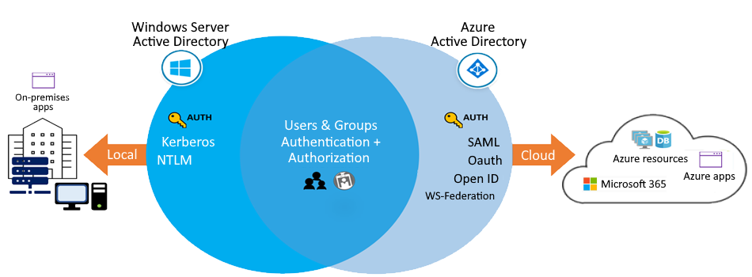

# Manage Identity and Governance in Azure

[Azure Active Directory (Azure AD)](https://learn.microsoft.com/en-us/azure/active-directory/) is Microsoft's multi-tenant cloud-based directory and identity management service. Azure AD helps to support user access to resources and applications, such as:

- Internal resources and apps located on your corporate network.

- External resources like Microsoft 365, the Azure portal, and SaaS applications.

- Cloud apps developed for your organization.

The following diagram shows an example implementation of Azure AD. In this scenario, Windows Server AD is using [Kerberos](https://learn.microsoft.com/en-us/windows-server/security/kerberos/kerberos-authentication-overview) and [NTLM authentication](https://learn.microsoft.com/en-us/windows-server/security/kerberos/ntlm-overview) to on-premises applications.

The following bullets describe the main components and concepts of Azure AD and explains how they work together to support service features.

- Identity: An identity is an object that can be authenticated. The identity can be a user with a username and password. Identities can also be applications or other servers that require authentication by using secret keys or certificates. Azure AD is the underlying product that provides the identity service.
- Account: An account is an identity that has data associated with it. To have an account, you must first have a valid identity. You can't have an account without an identity.
- Azure AD account: An Azure AD account is an identity that's created through Azure AD or another Microsoft cloud service, such as Microsoft 365. Identities are stored in Azure AD and are accessible to your organization's cloud service subscriptions. The Azure AD account is also called a work or school account.
- Azure tenant (directory): An Azure tenant is a single dedicated and trusted instance of Azure AD. Each tenant (also called a directory) represents a single organization. When your organization signs up for a Microsoft cloud service subscription, a new tenant is automatically created. Because each tenant is a dedicated and trusted instance of Azure AD, you can create multiple tenants or instances.
- Azure subscription: An Azure subscription is used to pay for Azure cloud services. Each subscription is joined to a single tenant. You can have multiple subscriptions.

## Compare Active Directory Domain Services to Azure Active Directory

Active Directory Domain Services (AD DS) is the traditional deployment of Windows Server-based AD on a physical or virtual server, which also includes Active Directory Certificate Services (AD CS), Active Directory Lightweight Directory Services (AD LS), Active Directory Federation Services (AD FS), and Active Directory Rights Management Services (AD RMS).

**Important:** Although you can deploy and manage AD DS in Azure VMs, its recommended to use AAD, unless your configuration targets IaaS workloads that depend specifically on AD DS.

| Characteristic | Azure AD | AD Directory Services |
| --- | --- | --- |
| Identity solution | Full identity solution | Primarily a directory service |
| Communication protocols | HTTP and HTTPS, with SAML, WS-Federation, OpenID Connect for authentication (and OAuth for authorization) | Kerberos |
| Federation services | Includes federation services, and many third-party services like Facebook | - |
| Structure | Flat structure | Organizational units (OUs) or group policy objects (GPOs).| 
| Managed service | You manage only users, groups, and policies | You manage deployment, configuration, virtual machines, patching, and other backend processes

## Azure Active Directory editions

- Free
- Microsoft 365 Apps
- Premium P1
- Premium P2

## Implement Azure Active Directory join

